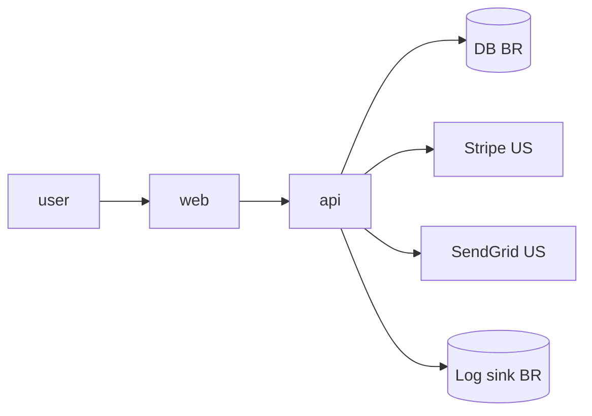

# Privacidade & LGPD — <Nome do Projeto>

> DPIA (Relatório de Impacto à Proteção de Dados Pessoais) simplificado.
> Renomeie para `docs/PRIVACY-LGPD.md` e atualize a cada mudança em coleta,
> tratamento, retenção ou compartilhamento de dado pessoal.

## 1. Identificação

- Controlador: <empresa, CNPJ>
- Encarregado (DPO): <nome, contato>
- Operadores (se houver): <ex.: Stripe, AWS, SendGrid>
- Versão deste documento: <data>

## 2. Dados pessoais tratados

| Dado | Categoria LGPD | Origem | Finalidade | Base legal | Retenção | Localização |
|------|-----------------|--------|------------|------------|----------|-------------|
| Nome | comum | usuário | identificação | execução de contrato (art. 7º V) | 5 anos pós-baixa | BR / AWS sa-east-1 |
| E-mail | comum | usuário | comunicação | consentimento (art. 7º I) | enquanto ativo | idem |
| CPF | comum | usuário | KYC, fiscal | obrigação legal (art. 7º II) | 5 anos pós-baixa | idem |
| Geolocalização | comum | dispositivo | analytics | legítimo interesse (art. 7º IX) | 90 dias | idem |
| Saúde | **sensível** | usuário | ... | consentimento específico (art. 11) | ... | ... |
| ... | ... | ... | ... | ... | ... | ... |

> Se houver **dado sensível** (saúde, biometria, religião, orientação sexual,
> origem racial, dado de criança/adolescente), a base legal segue regras
> mais estritas (art. 11). Sinalizar.

## 3. Fluxo dos dados

- **Transferência internacional?** Se sim, qual mecanismo? (cláusulas
  padrão, decisão de adequação, garantias específicas).
- Dados pseudonimizados/anonimizados em qual ponto?

## 4. Direitos do titular

Como o sistema atende cada direito (art. 18):

| Direito | Implementação | Rota / canal |
|---------|---------------|--------------|
| Confirmação e acesso | tela "Minha conta" + export JSON | `/me`, `/me/export` |
| Correção | tela "Minha conta" | `/me` |
| Anonimização / bloqueio / eliminação | botão "Excluir conta" + back-end purge | `/me/delete` |
| Portabilidade | export JSON estruturado | `/me/export` |
| Revogação de consentimento | switch em "Minha conta" + auditável | `/me/preferences` |
| Informação sobre compartilhamento | esta página + `/manual/privacidade` | `/manual/privacidade` |
| Reclamação à ANPD | link em `/manual/privacidade` | externo |

Cada ação dispara evento em `/admin/audit-logs` (`privacy.export`,
`privacy.delete`, `privacy.consent_revoke`).

## 5. Política de retenção

- Padrão: dados ativos até 30 dias após inatividade prolongada → soft delete;
  90 dias → anonimização; 5 anos (cumprimento legal) → purge físico.
- Logs técnicos: 30-90 dias.
- Audit-logs: ≥ 5 anos (append-only, immutable).
- Backups: criptografados, retenção 30 dias rolling.

## 6. Medidas de segurança

- Criptografia em trânsito (TLS 1.2+) e em repouso (AES-256).
- Mascaramento de PII em logs e telemetria.
- RBAC com princípio do menor privilégio.
- MFA para acesso administrativo.
- Trilhas de auditoria em `/admin/audit-logs`.
- Plano de resposta a incidente: ver `docs/RUNBOOK.md` §incidente.

## 7. Avaliação de risco (DPIA simplificado)

| Fluxo | Risco | Probabilidade | Impacto | Mitigação | Risco residual |
|-------|-------|---------------|---------|-----------|----------------|
| Login | vazamento de credencial | M | A | hashing Argon2id + MFA | Baixo |
| Export | uso indevido por insider | M | A | audit-log + alerta + rate limit | Baixo |
| ... | ... | ... | ... | ... | ... |

## 8. Notificação de incidente (art. 48)

- Detecção: alertas em `/admin/logs?level=error&category=security` e
  observability.
- Triagem: ver `docs/RUNBOOK.md` §incidente-de-segurança.
- Comunicação à ANPD e ao titular: prazo razoável; template em
  `docs/templates/INCIDENT-NOTIFICATION.md` (criar quando aplicável).

## 9. Aprovações

- DPO: ___
- Eng lead: ___
- Jurídico: ___
- Data: ___
