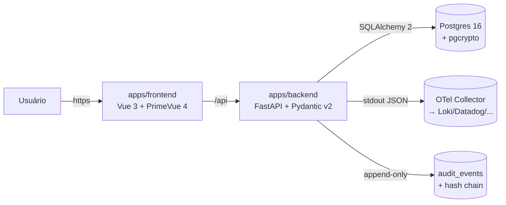

# SDD — <Nome do Projeto>

> Spec-Driven Design. Fonte da verdade técnica. Renomeie para `docs/SDD.md`.

## 1. Domínio
- Glossário (termos do negócio)
- Entidades + invariantes
- Eventos do domínio

## 2. Contratos
### 2.1 HTTP / OpenAPI
```yaml
openapi: 3.1.0
info: { title: <api>, version: 0.1.0 }
paths: {}
```
### 2.2 Eventos
| Topic | Schema | Produtor | Consumidor | Garantia |
|---|---|---|---|---|

## 3. Modelo de dados
- DDL/Prisma/Drizzle/SQLAlchemy.
- Estratégia de migrações.
- Política de retenção & LGPD.

## 4. Arquitetura

> **Stack padrão deste template** (ver `.cursor/rules/30-development.mdc`).
> Mudanças exigem **ADR**.



- Frontend (`apps/frontend`): Vue 3 + PrimeVue 4 (preset Aura) + Vite + TS + Pinia.
- Backend (`apps/backend`): FastAPI + Pydantic v2 + SQLAlchemy 2 + Alembic + Argon2id + structlog.
- Banco: Postgres 16 com extensão `pgcrypto`. Tabela `audit_events` com trigger
  bloqueando `UPDATE/DELETE` (append-only) e cadeia `prev_hash → hash` (sha256).
- Docker Compose para dev (`docker-compose.yml`) e prod
  (`docker-compose.prod.yml`).
- ADRs relacionados: `docs/adr/ADR-0001-*`.

## 5. NFRs
- Performance (P95): ...
- Disponibilidade: SLO 99.9%.
- Segurança: ASVS L2, LGPD.
- Acessibilidade: WCAG 2.2 AA.
- Observabilidade: logs estruturados, métricas RED, tracing OpenTelemetry.

## 6. Telas (referência)
- `/<rota>` — propósito, componentes, estados.
- `/manual` — obrigatório (`docs/screens/manual-screen.spec.md`).
- `/admin/logs` — obrigatório (`docs/screens/logs-screen.spec.md`).

## 7. Plano de testes
- Unit ≥ 80%, integração das rotas P0, contrato OpenAPI, E2E P0/P1, a11y,
  performance budgets.

## 8. Plano de release
- Feature flag `flag.<nome>`.
- Estratégia: canary 1% → 10% → 50% → 100%.
- Rollback: ...

## 9. Observabilidade
- Logs: schema do `docs/screens/logs-screen.spec.md`.
- Métricas: RED + 4 golden signals.
- Traces: OTel collector → Tempo/Jaeger.

## 10. Open questions
- ...
