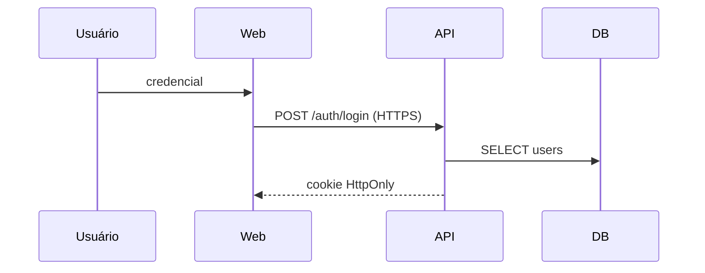

# Threat Model — <Nome do Projeto>

> Modelagem de ameaças. Renomeie para `docs/THREAT-MODEL.md`.
> Atualize sempre que houver mudança nos fluxos críticos
> (auth, pagamento, multi-tenant, integração externa, upload).

Frameworks de referência: **STRIDE** (Spoofing, Tampering, Repudiation,
Information Disclosure, Denial of Service, Elevation of Privilege),
**MITRE ATT&CK**, **OWASP ASVS L2**.

## 1. Escopo

- Sistema(s) cobertos: ...
- Versão / commit: ...
- Atualizado por / em: ...
- Fora de escopo: ... (com justificativa)

## 2. Ativos sensíveis

| ID | Ativo | Confidencialidade | Integridade | Disponibilidade | Notas LGPD |
|----|-------|-------------------|-------------|-----------------|-------------|
| A-1 | Credenciais | Alta | Alta | Média | dado pessoal |
| A-2 | Dados de cartão | Alta | Alta | Média | PCI-DSS / não armazenar |
| A-3 | CPF/RG | Alta | Alta | Média | dado pessoal sensível? |
| A-4 | Histórico financeiro | Alta | Alta | Alta | dado pessoal |
| ... | ... | ... | ... | ... | ... |

## 3. Perfis de atacante

| Perfil | Motivação | Capacidade | Acesso inicial assumido |
|--------|-----------|------------|--------------------------|
| Externo oportunista | financeira | scripts/ferramentas públicas | nenhum |
| Externo direcionado | espionagem/ransomware | 0-day, supply chain | nenhum |
| Insider mal-intencionado | financeira/vingança | acesso legítimo limitado | conta de operador |
| Insider negligente | acidente | acesso legítimo | conta admin |
| Conta comprometida | varia | depende do papel comprometido | sessão válida |

## 4. Fluxos críticos

(Use Mermaid `sequenceDiagram` para cada fluxo. Marque limites de confiança
com linha tracejada.)

### 4.1 Autenticação

### 4.2 Pagamento
### 4.3 Multi-tenant (escopo de tenant em toda query)
### 4.4 Upload de arquivo
### 4.5 Integração externa <X>
### 4.6 Export de dados

## 5. Ameaças × Mitigações por fluxo

Para cada fluxo, liste em formato STRIDE:

| ID | Fluxo | Categoria | Ameaça | Mitigação | Status | Risco residual |
|----|-------|-----------|--------|-----------|--------|----------------|
| TM-001 | 4.1 Auth | Spoofing | brute-force | rate-limit + lockout exp + MFA | implementado | baixo |
| TM-002 | 4.1 Auth | Tampering | session fixation | rotação no login + cookie SameSite=Strict | implementado | baixo |
| TM-003 | 4.1 Auth | Repudiation | usuário nega login | audit-log com IP/UA + hash chain | implementado | baixo |
| TM-004 | 4.3 Multi-tenant | Info disclosure | IDOR cross-tenant | tenantId em toda query + teste IDOR | parcial | médio |
| TM-005 | 4.4 Upload | Tampering | upload de exec | validar magic bytes, antivírus, isolar bucket | proposto | alto |
| ... | ... | ... | ... | ... | ... | ... |

## 6. Testes de segurança obrigatórios

A cada release com mudança nesses fluxos:
- [ ] Teste de IDOR (multi-tenant): usuário de tenant A tenta acessar
      recursos de tenant B em **todas** as rotas.
- [ ] Brute-force em `/auth/login` é bloqueado em N tentativas.
- [ ] CSRF em todos os forms cookie-based (token válido / inválido / ausente).
- [ ] CSP estrita (sem `unsafe-inline`/`unsafe-eval` quando possível).
- [ ] Headers (HSTS, X-Content-Type-Options, Referrer-Policy) verificados.
- [ ] SSRF: payload de fetch interno (`169.254.169.254`, `localhost:*`) é
      bloqueado.
- [ ] Upload: tentativas de tipo/tamanho inválido falham e geram log.
- [ ] Export: rate-limit aplicado, evento `data.export` em audit-log.
- [ ] DAST (OWASP ZAP) em staging passa baseline.

## 7. Riscos aceitos

Riscos conhecidos que **escolhemos não mitigar agora**, com motivo e prazo
de revisão.

| ID | Risco | Justificativa | Compensação | Revisão até |
|----|-------|---------------|-------------|-------------|
| RA-001 | ... | custo > impacto | monitoramento + alerta | YYYY-MM-DD |

## 8. Aprovações

- Eng lead: ___
- Security: ___
- DPO / Privacidade (se aplicável): ___
- Data: ___
